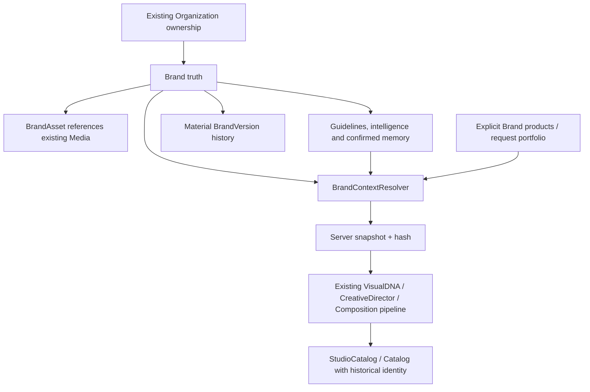

# Brand Intelligence V1

Repository: ScryLk/catana-renew. Dedicated branch: feat/brand-intelligence-persistence.
Base: origin/main at 3503232 (includes the responsive experience). No production deployment or automatic merge.

## Audit before implementation

The initial repository search returned 2,086 Brand/logo/identity references. Three independent read-only audits covered frontend persistence, Django ownership/assets and the actual generation call chain before implementation began. Existing feature regression baseline: 67 frontend tests in 7 files and 39 Django Studio/user-isolation tests passed. A focused Brand/Studio run also passed 15 tests in 2 files.

| Capability | Existing implementation | Classification | V1 action |
| --- | --- | --- | --- |
| Name, segment, voice, contacts | Brand interface and BrandModal/store CRUD | FRONTEND_ONLY | Preserve editor and persist canonical backend entity |
| Active Brand selection | BrandSelectorPill, activeBrandId, StudioSidebar | IMPLEMENTED_AND_WORKING locally | Keep consumers; load authorized backend brands |
| Local persistence | katana_studio_brands:userId | FRONTEND_ONLY | Retain rollback source; explicit org-bound migration |
| Logo upload | BrandModal FileReader, 3MB guard | FRONTEND_ONLY | Persist through existing Media infrastructure |
| Logo crop/color extraction | LogoAreaSelectorModal, colorExtractor | IMPLEMENTED_AND_WORKING | Reuse; retain user confirmation/provenance |
| Palette | customPalette/paletteName; manual catalog palette_data | IMPLEMENTED_BUT_INCOMPLETE | Distinguish truth/inference; normalize context |
| BRAND.md | Existing parser/template and BrandModal import | IMPLEMENTED_BUT_INCOMPLETE | Preserve prose; fix accented color labels; persist structured approved rules |
| Catalog grouping | Local arrays and brand_name string/substring matching | DUPLICATED | Replace heuristic pseudo-brand reconstruction with FK grouping |
| Backend Brand model/API | Absent | MISSING | Single organization-owned Brand domain |
| Catalog ↔ Brand | StudioCatalog.brand_name only; Catalog no relationship | NOT_CONNECTED | Nullable FK plus immutable historical snapshot |
| Product ↔ Brand | Product has Organization/Category, no Brand | MISSING | Nullable explicit FK; multiple brands can share org/category |
| Organization authorization | Existing Organization owner/member and admin/editor roles | IMPLEMENTED_AND_WORKING, with boundary gaps | Reuse membership/roles; validate all Brand relationships |
| Assets/media storage | Existing Media model/upload and image validator | IMPLEMENTED_AND_WORKING | BrandAsset references existing Media; no new storage |
| Generic upload validation | MediaSerializer does not validate logo contents | IMPLEMENTED_BUT_INCOMPLETE | Validate Brand asset type/size/content and tenant |
| Brand context in generation | Store/endpoint submit prompt/products only | NOT_CONNECTED | Canonical server resolver; pass context once |
| VisualDNA | Existing visual_dna.py derivation/seed | IMPLEMENTED_AND_WORKING | Brand baseline plus existing creative variation |
| CreativeDirector | Existing direction/font selection | IMPLEMENTED_BUT_INCOMPLETE | Confirmed Brand constraints and preferences |
| Actual palette | DesignPlanner defaults to gold independently | IMPLEMENTED_BUT_INCOMPLETE | Enforce constraints in actual palette and final validation |
| Composition/logo | Existing brand_hallmark branch never receives logo | NOT_CONNECTED | Connect safe asset policy to existing geometry |
| Logo renderer | Contain preserves ratio, hover scale can crop | IMPLEMENTED_BUT_INCOMPLETE | Disable decorative zoom/crop for Brand hallmark |
| Commercial truth | Existing CommercialIntegrityGuard | IMPLEMENTED_AND_WORKING | Preserve untouched; verify before/after repairs |
| Versions/snapshots | Absent | MISSING | Material versions; catalog generation captures server state |
| Structured guidelines | Absent | MISSING | MUST/PREFER/AVOID with provenance/status |
| Confirmed memory | Absent | MISSING | Explicit confirmation only; no autonomous self-modification |
| Portfolio intelligence | Existing Product.category | IMPLEMENTED_BUT_INCOMPLETE | Derive distribution from explicit Brand products/context |
| RAG | Template retrieval, no Brand documents | NOT_CONNECTED | Phase 2; V1 works without RAG |

No second Brand editor, logo extractor, storage subsystem, VisualDNA engine or authorization system is introduced. Legacy frontend shapes serve as compatibility adapters during migration.

## V1 scope and boundaries

V1 required: backend persistence and tenant ownership; current editor/selector reuse; explicit recoverable legacy migration; nullable product/catalog relationships; structured resolver; real pipeline effects; server snapshots and material versions; logo/palette/tone/BRAND.md persistence; deterministic category profiling; controlled load failure and tests.

V1 optional: lightweight understandable inference review and user-confirmed preferences. Phase 2: ML interpretation, vector/RAG document retrieval, automatic website analysis, autonomous repeated-action detection and advanced language/color interpretation. Untrusted documents are source data; they do not become system instructions. No website crawling is added.

## Architecture and validation

The implementation extends the existing Studio and Django API. The browser Brand shape is a compatibility adapter for the single backend domain.

### One domain, three responsibilities

Brand Truth is the customer-authored Brand identity, palette, free-text tone, contacts, source Markdown, typography and assets. Brand Intelligence is separate evidence: structured proposals with source, confidence and inferred/confirmed/rejected states, explicit guidelines and confirmed memories. Brand Expression remains the existing generative pipeline's direction, palette selection, typography and page composition for one brief/seed. A generated catalog never rewrites Brand Truth or Product commercial data.



### Ownership and migration

Brand requires an Organization. Existing owner/membership and editor/admin role conventions control access; viewer membership permits reads. As in the existing ownership contract, an organization owner or superuser can administer their organization even when their global role is viewer. Every Media/Product/Catalog association is checked against that exact organization, even when one user belongs to several organizations. Brand-linked resources require current tenant access; an old created_by value does not retain access after membership removal.

The legacy browser key is per user, not per organization. Therefore migration requires an explicit destination selected in the existing Brand UI; it cannot guess from the active organization. The exact authenticated user's original key remains intact for rollback. Canonical cache and migration markers are keyed by user, organization and schema version. Server uniqueness is based on tenant, importer and legacy ID rather than display name. Repeated import is idempotent; unauthorized/local catalog IDs never become fabricated database references. SVGs accepted by the former editor are rasterized locally using the existing image/crop utility before the strict backend image validator; original legacy data remains available.

Canonical loads and saves use backend objects. A temporary cache can support read-only error UX but cannot silently become authoritative. Tenant/session changes invalidate pending frontend results and cached active identity. The existing activeBrandId, selector and grouping consumers are retained through a compatibility adapter.

### Generation and historical identity

POST `/api/v2/studio/catalogs/generate/` keeps the existing anonymous unbranded contract. A persisted Brand or source catalog requires authentication and tenant write permission before any AI work. The endpoint resolves normalized Brand Context once, captures its version/hash, and passes that dictionary to the existing builder/pipeline. After generation it persists a StudioCatalog draft, spreads and chat thread using exactly that captured context; it returns `studioCatalogId` so the frontend does not create a second draft or race with a later Brand save.

Manual Studio creation binds the canonical Brand and server snapshot. Ordinary title/content saves cannot overwrite brand_snapshot/version/hash. A later Brand version leaves older catalogs untouched; source-catalog generation uses historical context. Deliberate reassociation/refresh requires an explicit identity update request, never an autosave. Private Studio responses expose history to authorized users; public reader payloads keep their allowlist and omit manuals, intelligence and memories.

The snapshot hash uses canonical sorted JSON and references assets rather than embedding binary files. Version creation compares material customer identity and confirmed rules; repeated identical saves do not create versions. Portfolio category distribution is an observation and does not itself rewrite customer identity. Archive preserves catalog history.

### Security and commercial boundaries

Brand documents are untrusted source data. Raw Markdown/manual text is retained privately for traceability and is excluded from agent instruction construction. Only normalized approved fields and constraints reach decision stages. Unsupported free-form rules require future semantic expansion; V1 must enforce its supported concrete palette/font/logo constraints in actual output and final validation, not merely mention them in a prompt.

Brand assets use the existing Media storage and image validator; types, sizes, content and tenant ownership are validated. No external website or logo URL is fetched by the backend. The existing Media URL infrastructure does not guarantee private byte access after an authorized URL is shared; API isolation and public snapshot redaction do not replace private storage delivery. A future private/signed delivery change belongs to the storage architecture, not a second Brand subsystem.

Product price, SKU, quantities, availability and technical data remain protected by CommercialIntegrityGuard. Category distribution is derived from explicitly linked Brand products or the supplied request portfolio; shared organization/category alone never proves brand ownership.

## API and data contract

| Resource | Contract |
| --- | --- |
| `/api/brands/` | Authenticated list/create; `organization` scopes the list; active by default; `status=all` includes archived history |
| `/api/brands/{id}/` | Read/update identity; DELETE archives; POST `restore/` reactivates |
| `versions/` | Read-only immutable numbered snapshots and hashes |
| `assets/` | Tenant-checked existing Media association or multipart upload; deactivation retains historical binaries |
| `guidelines/`, `memories/` | Structured MUST/PREFER/AVOID records with provenance, confidence and status |
| `intelligence/` | Read normalized context, category distribution and freshness; submit an inferred proposal |
| `decisions/` | Explicitly confirm or reject guideline, memory, intelligence or color |
| `/api/brands/migrate/` | Atomic idempotent explicit-tenant legacy import; returns legacy-to-canonical ID mapping |
| `/api/v2/studio/catalogs/` | Manual creation accepts nullable `brand_id`; server owns snapshots |
| `/api/v2/studio/catalogs/generate/` | Optional `brand_id` + `organization`, or historical `catalog_id`; returns the persisted `studioCatalogId` |

The additive migrations are `0032_brand_intelligence` and `0033_studio_generation_metadata`. Brand uses a UUID; existing Catalog, StudioCatalog and Product receive nullable protected Brand relationships. BrandVersion is immutable and uniquely numbered per Brand. BrandAsset references existing Media with validated dimensions/policy and an active flag. Guidelines and memory belong to that same Brand; supporting memory catalogs must match Brand and organization. Archive keeps existing catalog history available.

The existing modal now has Identity, Guidelines and Intelligence tabs. Explicit MUST/PREFER/AVOID lines imported from Markdown start as inferred proposals and require confirmation; plain text remains available for traceability. Suggested values never overwrite customer truth. Saving an unchanged material identity does not create another version. Category observations and proposed/rejected evidence do not increment the identity version; confirmation of an effective rule does.

## Pipeline effects and precedence

`views_studio.StudioCatalogGenerateView` authenticates Brand references and calls `BrandContextResolver.resolve` before `generate_catalog_from_gemini` and `EditorialGenerationPipeline.execute`. The pipeline applies that context to the existing requirement contract and ConstraintEngine, then derives VisualDNA, directs fonts and palette, plans actual pages and places the logo through CompositionPlanner. GenerationValidator and VisualCritic inspect the resulting document after repairs. CommercialIntegrityGuard retains its original responsibility throughout.

Customer truth and confirmed hard rules take precedence over inferred suggestions and creative preferences. Supported concrete rules cover named/hex color exclusion, registered font requirements/exclusion, serif exclusion, selected composition negatives and logo presence/proportion/crop/recolor/policy. Voice affects institutional/direct copy and approved contact content; the existing free-text tone editor remains available. Unknown hard rules, precise natural-language frequency/placement instructions and quantitative logo prose yield `BRAND_GUIDELINE_REQUIRES_REVIEW`; they cannot receive a passing quality gate. Uninterpreted PREFER rules remain advisory.

Logo placement uses actual dimensions, contain rendering, safe space, permitted page roles and maximum frequency. Logo blocks are excluded from decorative crop, rotation and scaling mutations. An external legacy logo URL is retained, but geometry is skipped until dimensions are available from a validated asset. Background policy uses approved light/dark/color variants; pixel-level logo/background analysis is Phase 2.

The server persists the branded generation quality gate alongside the snapshot. Public reading requires the saved gate to have `passed=true`, `publishable=true` and `status=passed`. Client content saves cannot replace that gate. Material page, palette, font, page-count or identity edits invalidate approval; idempotent content saves preserve it. The save response returns the updated gate so the editor reflects the server's decision. Editing an approved generated draft requires review or regeneration before public sharing; a separate manual revalidation UI is Phase 2. Existing manual and unbranded catalog behavior remains compatible. Public reader/explore never includes raw Brand manuals, intelligence or memory, including cached explore responses requested by organization members.

Intelligence freshness compares customer identity, manual, active assets, palette, typography, voice, category distribution and explicitly linked Product IDs/names/descriptions/category/image references. Portfolio name/photo changes invalidate stale interpretations even when category counts stay unchanged. Price and stock changes do not invalidate unrelated Brand analysis. Product source data is only read; source fingerprints do not train, confirm or rewrite identity.

## Verification and delivery

All test databases and generated browser artifacts are isolated from production. Backend tests use a synthetic SECRET_KEY, DEBUG=True and an explicit SQLite DATABASE_URL. Browser tests exercise the real frontend against controlled API fixtures; real Django persistence and generation are separately exercised by integration tests, without external model/provider calls.

| Validation | Exact result |
| --- | --- |
| Full Django API suite | 340 tests passed in 48.559s |
| Frontend Vitest | 86 tests passed in 8 files; 2.24s |
| Production frontend build | PASS; font registry check, TypeScript and Vite; 7.26s; existing large-chunk warning |
| Brand browser suite | 13 tests passed in 29.2s; 12 inspected screenshots across 320/390/844/1440 widths |
| Existing responsive smoke | 7 tests passed in 1.0m; 14 routes at 320/1440, Studio/reader rotation and 30 dialogs |
| Django system check | No issues |
| Django migration drift | No changes detected |
| Migration forward → backward → forward on isolated SQLite | PASS; pre-existing unbranded draft, SKU, price and stock retained |
| Independent security boundary review | Original tenant/asset/public/migration checks passed; edited-content public GET 403 and idempotent-save public GET 200 verified |
| Global ESLint comparison | 249 existing errors / 20 warnings, versus 250 / 20 in unchanged base; zero added diagnostics |
| Diff whitespace | Clean |

Backend commands, from `backend/`:

```bash
SECRET_KEY=brand-test-only-key DEBUG=True DATABASE_URL=sqlite:////tmp/catana-brand-tests.sqlite3 /tmp/catana-backend-venv/bin/python manage.py test api --noinput
SECRET_KEY=brand-test-only-key DEBUG=True DATABASE_URL=sqlite:////tmp/catana-brand-tests.sqlite3 /tmp/catana-backend-venv/bin/python manage.py check
SECRET_KEY=brand-test-only-key DEBUG=True DATABASE_URL=sqlite:////tmp/catana-brand-tests.sqlite3 /tmp/catana-backend-venv/bin/python manage.py makemigrations --check --dry-run
```

Frontend commands, from `frontend/`:

```bash
npm test -- --run
npm run build
npx eslint . -f json
npx playwright test --config=/tmp/catana-brand-browser.config.cjs
npx playwright test --config=/tmp/catana-brand-responsive-smoke.config.cjs --grep 'critical routes fit 320x568|critical routes fit 1440x900|phone Studio keeps prompt|editor dialogs fit|reader fit and page selection'
```

The browser config uses the installed Chromium at `/usr/bin/chromium` and isolated Vite at `127.0.0.1:5175`. The test suite is checked into `frontend/e2e/brand-intelligence.spec.ts`; local runtime configs and migration-check script are included in the review artifacts. The global lint command exits 1 because of the pre-existing debt; it is not reported as a clean lint run. No existing tests were deleted.

The 67 existing frontend tests are retained alongside 19 new Brand regression tests. The full backend suite includes 27 Brand domain tests, 24 observable pipeline tests and 19 Studio persistence/approval integration tests. The remaining existing tests cover the prior AI, Studio and user-isolation behavior. Browser fixtures use the real backend `brand` field shape and numeric color decision IDs, avoiding adapter aliases that could conceal contract mismatches.

Obsolete authoritative browser CRUD writes and name/substring-based pseudo-brand reconstruction were removed. The legacy source reader remains solely for explicit migration/rollback. Editor/selector/logo extractor and commercial pipeline components remain the shared implementation.

## Phase 2

- Brand document parsing beyond explicit rule lines, vector/RAG retrieval and website analysis.
- Pixel-level logo/background compatibility and advanced narrative/quantitative guideline interpretation.
- Autonomous proposal detection from repeated edits; V1 accepts only explicit memory and confirmations.
- A historical identity comparison/update UI; the backend already supports an explicit refresh without changing old catalogs automatically.
- Manual revalidation of edited generated drafts before public sharing.
- Private or signed Media delivery using the shared storage architecture.
- Full asset-library and product-to-Brand assignment UI; V1 exposes these relationships through the existing API and retains the current logo/manual editor.

No production migration, deployment, automatic merge or force push is performed by this task.

## Files changed

```text
backend/api/ai/agents/base.py
backend/api/ai/catalog_builder.py
backend/api/ai/composition_mutator.py
backend/api/ai/composition_planner.py
backend/api/ai/constraint_engine.py
backend/api/ai/creative_director.py
backend/api/ai/design_planner.py
backend/api/ai/generation_validator.py
backend/api/ai/pipeline.py
backend/api/ai/requirement_contract.py
backend/api/ai/seed_utils.py
backend/api/ai/visual_critic.py
backend/api/ai/visual_dna.py
backend/api/migrations/0032_brand_intelligence.py
backend/api/migrations/0033_studio_generation_metadata.py
backend/api/models.py
backend/api/permissions.py
backend/api/serializers.py
backend/api/serializers_brand.py
backend/api/services/brand_intelligence.py
backend/api/tests_brand.py
backend/api/tests_brand_pipeline.py
backend/api/tests_brand_studio.py
backend/api/urls.py
backend/api/views.py
backend/api/views_brand.py
backend/api/views_studio.py
backend/api/views_transparency.py
docs/brand-intelligence.md
frontend/e2e/brand-intelligence.spec.ts
frontend/src/components/ContextSelector.tsx
frontend/src/components/studio/BrandModal.tsx
frontend/src/components/studio/BrandSelectorPill.tsx
frontend/src/components/studio/GenerativeBlockRenderer.tsx
frontend/src/components/studio/StudioSidebar.tsx
frontend/src/pages/KatanaStudio.tsx
frontend/src/services/brandService.test.tsx
frontend/src/services/brandService.ts
frontend/src/store/studioStore.ts
frontend/src/utils/brandMarkdownParser.ts
frontend/src/utils/catalogGenerator.ts
```
