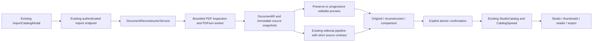

# Universal Document Import Engine

Repository: ScryLk/catana-renew. Branch: feat/universal-document-import.
Base: origin/main 1d113c8, including the merged Brand Intelligence PR #6.

## Audit before implementation

Read-only frontend, backend, AI, security, geometry and browser audits established the actual runtime before implementation. The existing path is ImportCatalogModal → StudioCatalogImportDocumentView → DocumentReconstructorService → pypdf text/images → heuristic page/product reconstruction → immediate StudioCatalog/CatalogSpread persistence → Studio renderer. Native catalogIO v1 remains a separate explicit-geometry path.

| Capability | Existing code | Status | Confirmed gap / reuse action |
| --- | --- | --- | --- |
| Upload, drag/drop, title, responsive dialog | ImportCatalogModal | IMPLEMENTED_AND_VALID | Preserve the component and controls |
| PDF extraction | DocumentReconstructorService.extract_pdf_data | IMPLEMENTED_BUT_INCOMPLETE | Text/image extraction loses geometry; retain pypdf inspection, add a geometry-capable adapter |
| Faithful/redesign | UI labels and mode argument | NOT_CONNECTED | Both execute the same algorithm; mode is unused |
| Commercial candidates | _build_product_list | IMPLEMENTED_BUT_INCOMPLETE | Invents prices/SKUs/descriptions/claims; replace with source-bound nullable candidates |
| Page count | Reconstruction and Studio hydration | IMPLEMENTED_BUT_INCOMPLETE | Adds a fake contact page; DB defaults to six pages; frontend fabricates empty right pages |
| Source dimensions | Model/render/export defaults | IMPLEMENTED_BUT_INCOMPLETE | Forces A4; preserve per-page dimensions and scale the viewport |
| Background removal | BackgroundRemovalService | IMPLEMENTED_AND_VALID | Keep optional explicit operation; remove global/default destructive import behavior |
| DOCX | UI only | FRONTEND_ONLY | Bytes reach PDF parser; mark unsupported until a real converter exists |
| Source snapshots/original file | Absent | MISSING | Every accepted page needs a genuine retained visual source |
| DocumentIR and provenance | Absent | MISSING | Preserve geometry before semantics; unknown remains unknown |
| Preview/report/quality | Absent | MISSING | Analyze and show actual output before confirmation/persistence |
| Import authorization | AllowAny endpoint | IMPLEMENTED_BUT_INCOMPLETE | Anonymous persistent imports and first-org selection; reuse current tenant/write rules |
| Source asset privacy | Direct MEDIA_ROOT writes | IMPLEMENTED_BUT_INCOMPLETE | Nginx serves that root publicly; private source storage and authorized delivery are necessary |
| Native catalogIO | catalog_ingest/import_json | IMPLEMENTED_AND_VALID | Preserve round-trip; fix unscoped destructive replace authorization |
| CommercialIntegrityGuard | Existing AI guard | IMPLEMENTED_AND_VALID | Reuse; add source content validation for editorial facts outside Product blocks |
| Redesign AI | Existing generative pipeline | NOT_CONNECTED | Only explicit redesign may invoke it; disable invented default claims/contact copy |
| OCR | No configured runtime feature | MISSING | Expose capability honestly; scanned pages remain visually preserved |
| Background jobs | No queue framework | MISSING | Bound synchronous analysis with isolated worker timeout, not an unnecessary queue stack |
| Legacy contingency synthesis | Old demo helper | DEAD_CODE | Do not reconnect it to document import |

All ten suspected weaknesses were verified. Additional findings: malformed input fabricates a successful two-page catalog; image count is treated as product count; internal exceptions are exposed; import is non-transactional; native replace can clear another tenant's catalog; odd-spread navigation can duplicate a real page.

## Plaswill reference

The customer attachment is used only as a local manual reference and is not committed. Its SHA-256 is `4dd5a20ec09b301ba47a03ca1819a925ee6aaeceb031468bf6089a431b35adea`: 5,601,050 bytes, eight pages, each 595.276 × 841.89 pt, rotation zero. All pages have digital text. The cover contains vector identity with no extracted raster image. Pages 3–7 each show two product groups despite four raster resources. The institutional and closing factory photographs are not product cutouts. No prices or labeled SKU fields were found; dimensions/capacity labels must not be converted into prices or invented references.

## Design decisions

Keep DocumentReconstructorService as the single coordinator. A common DocumentIR separates source geometry from semantic proposals and presentation mode. Keep pypdf for bounded inspection; choose pypdfium2/PDFium for geometry and rendering after recording its permissive licenses, avoiding an unreviewed AGPL dependency. Source snapshots survive reconstruction or AI failure. Editable elements retain their original inert raster appearance until an explicit edit; a clean fallback layer preserves unsupported visuals without duplicate text. Redesign alone uses the existing editorial pipeline and an additional source integrity contract.

Default import is Preserve Original. DOCX is truthfully unavailable in V1; users can export it as PDF. Original documents and preview assets require private storage outside the public MEDIA_ROOT because the existing Nginx configuration publishes that root. This is a necessary privacy boundary, not a second general-purpose media subsystem.

## Runtime architecture



There is one document import coordinator and endpoint. The previous pypdf image-count/template/product synthesis was removed. pypdf remains useful for structural inspection, PDFium supplies geometry and pixels, and native catalogIO v1 stays separate. Existing Brand resolution, tenant access, quota guard, generation pipeline, commercial guard and source renderer/export surfaces are reused.

Analysis creates a private `DocumentImport` and its import-only assets, not a `StudioCatalog`, `Product`, `Brand` or public `Media`. The job UUID starts in memory; the first database insert occurs only after the worker has completed source capture, avoiding a SQLite write lock across native parsing. Confirmation locks only the job row, creates the catalog/spreads/chat atomically and records its source history. Repeating confirmation for the same job returns the same catalog; analyzing the same file again deliberately creates a separate job. SQLite write conflicts return controlled 409 `document_import_retry_conflict`, allowing a safe retry. A successful server confirmation followed by a failed client reload can safely be retried. Late frontend responses cannot hydrate another user/organization or a dismissed import.

## Modes and fidelity

| Mode | Behavior | AI requirement |
| --- | --- | --- |
| `preserve` (default; old `faithful` alias) | Displays every immutable source snapshot in its exact source geometry | None |
| `editable` | Admits safe text layers over a clean fallback, keeping original appearances until an explicit edit | None |
| `redesign` | Uses the existing editorial composition pipeline with source-bound text, images, geometry and optional approved Brand context | No external provider required by the current deterministic pipeline |

The adapter first captures **all** source pages, reserving the snapshot budget before optional extraction. If extraction fails on one page, that page remains source-only. If a source page cannot be rendered safely, the input is rejected rather than accepted with a missing page.

Progressive reconstruction currently admits at most eight direct, opaque, axis-aligned, non-overlapping text objects per page with known font mapping and validated geometry. The worker removes those objects, renders the clean fallback, and restores their original raster crops. This composed bitmap must match every source pixel exactly. Otherwise the page falls back to its original snapshot. Complex vectors, forms, clipped or transformed content, unknown fonts and unsupported typography remain raster visuals. There is no duplicate original text under an edited layer. Editing uses the resolved browser font and warns about substitution; it does not claim the edited result has source fidelity.

Initial exact-pixel verification measures the worker bitmap composition, not an unmeasured browser typography approximation. An isolated transparent render creates the admitted text object's complete ink mask. Every nonzero ink pixel must contribute to the actual source-versus-clean-base difference before `sourceVisible=true` is admitted. Off-crop, invisible, white-on-white and partially concealed strings remain private metadata; one visible character cannot approve a hidden remainder. Unknown visibility, failed pixel composition or optional extraction failure cannot promote content into redesign. Browser comparisons separately exercise scaled source and editable layers. Source-only pages are visual preservation, not editable reconstruction. Export preserves physical size but rasterizes the rendered page; original PDF vectors and searchable text are available in the retained source, not guaranteed in the exported PDF.

Background removal is never invoked during import, regardless of old `remove_bg` input. Original source and extracted PNGs stay intact. The existing explicit product-background operation remains available elsewhere; the import UI truthfully marks product isolation unavailable at this step.

## Adapter and DocumentIR contracts

`DocumentImportAdapter.analyze(file_bytes, filename, asset_sink) -> DocumentIR` isolates parser work from authorized storage. The sink accepts `(inert_bytes, filename, kind)` only in the parent process. Render kinds are `source_snapshot`, `raster_fallback`, `element_appearance` and `image`; `source` is the original PDF and is never public.

DocumentIR has `schemaVersion`, `sourceFingerprint`, adapter/file type, exact `pageCount`, ordered `pages`, detached `candidates`, and a report. Each PageIR retains:

- Display width/height in points after visible crop and rotation, original MediaBox/CropBox/BleedBox, rotation, source hash and mandatory snapshot.
- Page-local classification/evidence/confidence, visibility, optional clean fallback, quality and warnings.
- Text/image/vector/group/raster metadata in normalized top-left display coordinates, source bounds/matrix, stacking, colors/opacity, fonts and provenance.
- Per-element source page/object/bounding box, verbatim source text/hash and confidence; these fields remain immutable through text revisions.

Snapshots contain a private API URL, asset UUID, content hash and actual raster dimensions. Non-editable source bounds can extend outside the crop; they are retained as evidence while the page renderer clips display content. Ordinary legacy PageData continues to use its existing geometry defaults.

Semantic recognition follows geometry and only marks exact source substrings for prices, labeled references, dimensions and contacts; relative font size can suggest a heading. Uncertain product identity is **not established** and remains visual/source content. The Plaswill's four images per product page are not promoted into four products. Automated product grouping/mapping remains unavailable in V1; `candidates=[]` is an honest result. No guessed product entities enter the commercial database.

`OCRProvider.recognize_page(snapshot_bytes, *, source_hash, page_number, width, height)` defines a future inert-input capability. `OCRTextElement` carries snapshot hash, page, bounding box in display points, explicit coordinate space, confidence and text. A future caller must validate all of these and retain the source; low-confidence OCR cannot become a reliable editable layer. No provider is installed/configured/called in V1: `ocrAvailable=false`. Scans remain source-only; hybrid classification uses conservative raster-text evidence per page, not photo count.

## Commercial and source integrity

Absent prices, labeled SKU, specifications, availability, contacts and descriptions remain unknown/null or absent. The importer does not insert `CAT001`, `Sob consulta`, invented premium claims, fake descriptions, contact pages or derived commercial fields. Source strings are data, never agent instructions. For example, a page saying “create 99 pages” cannot change the imported count.

Redesign passes canonical source IR into the **existing** builder, requirement/composition/content/design planners, validator and repair engine. A strict source contract checks source identity, page order/count/geometry, text/provenance, image references and extra commercial fields before and after repair. Brand supplies approved visual choices; missing source contacts or promotional copy cannot be filled from generic defaults or unseen Brand facts. Unsupported vectors, scans or excessive density preserve only their own page and mark the proposal for review. An exception or external-AI unavailability cannot destroy the captured source.

The optional Brand selector binds an existing active same-organization Brand and its historical context/version/hash. It never creates or updates Brand Truth from catalog inference. Inferred Brand information remains subject to the existing Brand Intelligence approval rules. Product candidates are detached JSON; creating/linking authoritative products needs a separate explicit mapping workflow, which this V1 does not expose.

## Geometry and presentation

Page count is exact. For seven pages, the database stores seven PageData objects and four spreads; the last right element list is empty. The final visual slot is virtual and never persisted/exported as a page. Studio navigation uses the same last-page sentinel without duplicating the last real page.

Studio, filmstrip/thumbnail, original/reconstructed/comparison preview, public reader and offscreen export use per-page geometry. Viewports scale pages instead of converting them to A4. Mixed spreads sum widths and use the greater height. PDF export converts points to millimeters (`25.4 / 72`), uses each page's format/orientation and waits for private assets; a missing source image prevents a blank export. Canvas capture is bounded to 16 million pixels and 32,767 pixels per side. Oversized high-resolution PDF/PNG capture fails clearly before allocation, rather than crashing the browser or silently changing the source size. Legacy catalogs retain 490 × 693 viewport/A4 export behavior.

The Studio v2 `.catana` export now records source-per-page geometry and truthfully states that v2 bundle reimport is unavailable. Existing catalogIO native v1 API roundtrip remains supported, including replace authorization before any destructive clear. Private image references in exported JSON still require source-organization access.

## API lifecycle

| Existing import route `/api/v2/studio/catalogs/import-document/` | Result |
| --- | --- |
| POST multipart `action=analyze`, PDF, organization, title/mode/optional brand | Private source analysis and preview; no catalog creation |
| GET `?import_id=<uuid>` | Authorized preview/status/report |
| POST JSON `action=prepare`, import ID, mode/optional brand/brief | Reuses canonical IR and updates the proposal before confirmation |
| POST JSON `action=confirm`, import ID, title/mode/optional brand | First response 201; idempotent retries 200 with the same catalog |
| DELETE `?import_id=<uuid>` | Removes an unconfirmed preview and private files |
| GET `assets/<uuid>/` | Tenant-authorized original/PNG; opted-in public render PNGs only |

Preparing a new redesign/Brand choice requires inspecting its updated preview. The UI reports actual analysis, preview preparation and saving operations instead of fabricated timed stage percentages. Analysis runs synchronously in a bounded worker because the repository has no configured queue system. The existing 120-second Gunicorn timeout exceeds the 45-second worker deadline.

## Privacy, authorization and retention

Persistent analysis/prepare/confirm require authentication, current organization membership and write role. Preview/assets may be read by current same-organization members; foreign or removed members cannot access them, even if they originally created the catalog. Explicit cross-organization Brand and native-replace requests fail before mutation. Confirmation reuses the current quota guard; retries are not charged twice.

`DOCUMENT_IMPORT_PRIVATE_ROOT` must resolve outside `MEDIA_ROOT`, including through symlinks. Original PDFs and PNGs use import-only private storage; their FileField does not expose a public storage URL. Production Compose defines a private backend volume that Nginx does not mount. `.gitignore` excludes local private files, and the backend `.dockerignore` keeps that default private directory out of image builds. Responses use `private, no-store` and `nosniff`; original PDFs download as attachments.

Imported catalogs start private. The explicit Share action opts in through a server-side `share_import` decision only after passing the captured-source gate. The server verifies the actual current pages, canonical snapshots, source fingerprint, provenance, page count and geometry against the job, rather than trusting a client approval flag. Only PNGs referenced by the public rendering projection become anonymously accessible; unused extracted images and the original PDF remain private. Sharing can be revoked. Content edits revoke approval and sharing; unchanged saves retain both. V1 cannot reapprove edited imported pages without review/new import, so the UI does not promise an edited document can immediately be shared. Public payloads omit private import metadata, original-file location, provenance, source text/evidence and Brand intelligence. Source-only pages publish only geometry and the snapshot. Unedited hybrid elements publish their raster appearance without the original text layer; detached inventory is omitted. Redesign cannot make hidden source text visible merely because it exists in the private PDF extraction.

Unconfirmed previews expire after 24 hours by default. Access expires immediately; physical deletion requires periodic `python manage.py prune_document_imports`. The command locks and rechecks jobs, deletes files after commit, and never deletes confirmed source history. Explicit cancellation cleans unconfirmed files. Failed analysis rolls back the job and removes its partial assets. Confirmed histories are retained for source comparisons; no automatic post-confirm retention policy is introduced. Deleting a catalog can leave its confirmed source history for audit. Operators must provision the private volume and schedule pruning when deploying this branch.

## File security and limits

The parent checks upload size before a bounded read, extension, MIME, PDF magic and filename controls. In the worker, pypdf inspects bounded objects/references, geometry and active content before PDFium renders. Parsing/native rendering runs in a subprocess with CPU/address-space limits and a parent deadline; PDFium is never called concurrently in threads. No external URLs, attachments, JavaScript, launch actions or executables are executed/fetched. Active content/embedded files are rejected; safe links are inert source information. Nonempty interactive forms and unsupported UserUnit are rejected with clear instructions rather than silently omitted. Encrypted and malformed documents fail safely, without demo fallback or source exception disclosure.

| Bound | Limit |
| --- | --- |
| Uploaded source | 25 MiB |
| Pages | 50 |
| Raster pixels per page/image | 12 million |
| Total source/embedded-image pixel budget | 120 million |
| Assets / raw inert asset bytes | 500 / 128 MiB |
| PDF objects / per-page geometry objects | 20,000 / 5,000 |
| Graph nodes/depth | 200,000 / 64 |
| Metadata string / total metadata | 1 MiB / 8 MiB |
| Maximum page dimension | 14,400 pt |
| Worker wall time / address space | 45 seconds / 768 MiB |

Snapshots target 144 dpi and adapt downward within the page pixel budget; the report records actual dimensions/scale. This is a bounded V1 preservation format, not a promise to process arbitrary unlimited documents. DOCX is rejected with 415 before opening its ZIP; users must export it to PDF. No DOCX fidelity claim is made.

## Dependency and license review

Installed versions verified from package metadata: pypdf 6.18.0 (BSD-3-Clause), Pillow 12.2.0 (MIT-CMU), and newly pinned pypdfium2 5.14.0 (BSD-3-Clause / Apache-2.0 plus bundled dependency licenses). PDFium 156.0.8076.0 and its packaged third-party license notices remain included in the installed wheel. That wheel reports no V8/XFA build flags; the application additionally rejects active/form input. No PyMuPDF/AGPL library was added. Poppler is used only for local manual reference inspection, not a new production dependency. Existing dependency licenses are unchanged.

## Validation and production gate

The committed tests generate inert synthetic PDFs and browser fixtures. Customer attachments, original PNGs and screenshots stay outside Git. Adapter tests cover cover, institutional-photo, two-group, dense-grid and contact fixtures with exact initial bitmap composition; digital/scanned/hybrid, missing fonts, clipping, rotation/crop, custom sizes, odd pages, extraction failures, source-render failure and timeout are exercised separately. API tests cover preview-before-persist, idempotency/quota, tenant roles, private storage/sharing, immutable source/edit invalidation, expiry/cancellation, DOCX/invalid files and native replace scope. Frontend tests cover atomic canonical hydration, scope races, retries, asset authentication, text edit/reset, odd slots, unchanged saves and real serialized mixed-size PDF MediaBoxes.

The initial import commit (`c192cd0`) backend regression command passed **421 tests** in 55.626 seconds:

```bash
SECRET_KEY=import-test-only-key DEBUG=True DATABASE_URL=sqlite:////tmp/catana-import-tests.sqlite3 DOCUMENT_IMPORT_PRIVATE_ROOT=/tmp/catana-import-test-private /tmp/catana-backend-venv/bin/python manage.py test api --noinput
```

This final run includes the public rendering projection and the hidden-source redesign fix. Focused adapter validation passed 24 tests in 3.551 seconds; source redesign validation passed 25 tests, including an attempted repair promotion of hidden text. Both complete-source integrity and visual admission are checked again after repair. Unknown source-image visibility also fails closed to the source page.

An independent final Django APIClient boundary harness passed 4 tests / 7 real synthetic PDF scenarios in 1.459 seconds: preserve, editable hybrid, off-crop text, invisible render mode, white-on-white, partially concealed text and a positive visible-text redesign. Hidden-source cases retain private evidence, preserve the source page, reject Share with 400 and public reads with 403. The positive case admits painted text and shares with 200. Unused image/raw-PDF reads return 404; revocation blocks the catalog and PNGs. No security blockers remain in the reviewed scope. Its session-only harness/log are outside Git; committed adapter, source-guard and API regressions cover these boundaries.

The frontend build and unit regressions passed. Existing ESLint debt is measured against main: baseline 249 errors/20 warnings; current 248/20, with no added diagnostics. No unrelated lint cleanup is included.

Actual Plaswill API test: analysis completed in 2.866 seconds; 8 pages/4 spreads; original SHA-256 unchanged; zero automatic Product records; authorized original attachment; private-by-default catalog; explicit render-only sharing/revocation; foreign/viewer/removed-member boundaries passed. All 8 pages retain exact source snapshots and source geometry. Its unsupported fonts/clipping produce 0 editable elements, reported honestly. Automatic product grouping is not claimed.

Actual Plaswill browser test passed in 14.6 seconds. It uses the exact responses/PNG bytes produced by the real Django APIClient, intercepted at the browser HTTP transport; it is not a live end-to-end network/backend test. Each of the eight normalized 1191 × 1684 page screenshots had **0 changed pixels and 0 mean absolute channel error** against its retained PNG. Four unchanged spread saves preserved canonical IR, reopening kept 8 pages/4 spreads, and 320/390/1440 layouts passed. Real API sharing/authorization was tested separately above. Local customer artifacts are under `/workspace/catana-import-qa/manual-api` and `/workspace/catana-import-qa/manual-browser-result.json`, never committed.

The final committed synthetic browser suite passed **14/14 in 40.8 seconds**, covering PDF/DOCX/size controls, private preview/cancellation, exact editable appearances, text edits/provenance, odd and mixed geometry, explicit Brand selection, updated-preview requirements, retry/idempotency, cancelled/late responses and organization changes. The text editor uses the existing ResponsiveModal portal outside the canvas transform, keeping 44-pixel controls reachable at 320 pixels. Asset loading depends on URL/hash/context instead of wrapper identity, preventing repeated fetches during export progress. For reviewers, the standard repository config can run the fixture suite with `PLAYWRIGHT_CHROMIUM_EXECUTABLE=/usr/bin/chromium npm run test:e2e -- e2e/document-import.spec.ts`; the session used its equivalent temporary config pointing to the isolated Vite server on port 5177.

The final frontend regression suite passed **110/110 tests across 11 files**. It includes previous-document save failure/retry, delayed same-organization generation and CoPilot stream rejection after import, cancellation preserving current work, and safe rejection before oversized export allocation. Import confirmation persists the outgoing session and awaits its save; a failed save keeps the current document and prevents confirmation. Document identity/epoch guards reject older image/sprite/stream operations without confusing analysis cancellation with changing the document.

| Exact session command (frontend directory unless indicated) | Result |
| --- | --- |
| `SECRET_KEY=import-test-only-key DEBUG=True DATABASE_URL=sqlite:////tmp/catana-import-tests.sqlite3 DOCUMENT_IMPORT_PRIVATE_ROOT=/tmp/catana-import-test-private /tmp/catana-backend-venv/bin/python manage.py test api --noinput` (backend directory) | 421 passed, 55.626 seconds |
| `SECRET_KEY=synthetic-adapter-test DEBUG=False ALLOWED_HOSTS=testserver DJANGO_SETTINGS_MODULE=catana_back.settings /tmp/catana-backend-venv/bin/python -m django test api.tests_document_adapter --verbosity 1` (backend directory) | 24 passed, 3.551 seconds |
| `SECRET_KEY=import-final-boundary DEBUG=True DATABASE_URL=sqlite:////tmp/catana-import-final-boundary.sqlite3 PYTHONPATH=/workspace/catana-import/backend PYTHONDONTWRITEBYTECODE=1 /tmp/catana-backend-venv/bin/python /tmp/catana-import-final-boundary.py > /workspace/catana-import-qa/security-final.txt 2>&1` (backend directory; session-only harness) | 4 tests / 7 PDF boundary scenarios passed, 1.459 seconds |
| `npm test -- --run` | 110 passed, 3.00 seconds |
| `npm run build` | Font registry, TypeScript and Vite passed; 7.13-second Vite build; existing chunk-size advisory |
| `npx eslint . -f json -o /tmp/catana-import-lint-final.json` | Existing debt: 248 errors/20 warnings; baseline 249/20; zero added diagnostics |
| `npx playwright test --config /tmp/catana-import-browser.config.cjs --workers=1` | 14 passed, 40.8 seconds |
| `npx playwright test --config /tmp/catana-import-manual-browser.config.cjs --workers=1` | Actual reference browser test passed, 14.6 seconds |
| `SECRET_KEY=import-test-only-key DEBUG=True DATABASE_URL=sqlite:////tmp/catana-import-tests.sqlite3 /tmp/catana-backend-venv/bin/python manage.py check` (backend directory) | No system issues |
| `SECRET_KEY=import-test-only-key DEBUG=True DATABASE_URL=sqlite:////tmp/catana-import-tests.sqlite3 /tmp/catana-backend-venv/bin/python manage.py makemigrations --check --dry-run` (backend directory) | No model/migration drift |
| `git diff --check` (repository root) | Passed |

Remaining limitations: PDF-only; no OCR provider; no interactive-form/UserUnit support; vectors/unknown fonts remain raster; safe text editability is partial; source snapshots/export have bounded raster resolution; no product mapping UI; edited imports require a review workflow that V1 does not provide; confirmed-source retention follows explicit history preservation; physical preview cleanup needs a scheduler; external production credentials/provider calls and PostgreSQL runtime were not exercised. Migration 0034/private-volume setup must be reviewed before deployment. This work does not deploy or apply production migrations.

## PR #7 CodeQL follow-up

The six reported findings were inspected at their actual data-flow boundaries:

- `provider.py` used an unbounded decimal/whitespace percentage regex. An isolated benchmark of 1,000 / 2,000 / 4,000 unmatched digits took approximately 0.007 / 0.028 / 0.119 seconds, confirming quadratic growth. Operational percentages and page operands now use a linear Unicode-decimal scanner with bounded integer conversion. Oversized numeric tokens are rejected rather than matching a suffix or applying the default percentage.
- The PDF subprocess received the uploaded filename as one argument. It already used an argument list without a shell; the alert does not establish arbitrary shell execution. The launch arguments are now entirely fixed, the cheap source envelope is validated before launching, and unchanged PDF bytes travel only through stdin. The worker uses a fixed internal PDF name; original filename metadata stays private in the existing coordinator/storage. Regression tests launch the real worker with option/shell-shaped filenames and verify unchanged source hashes and PNG bytes.
- Successful analyze/prepare/confirm/status responses could contain exception text when a redesign failure started with `SOURCE_`. Source fallback reasons now select literal values from an exact public code map, including after composition/repair. Unknown errors retain the source with a fixed review reason. Worker/API failures also select static public code/message/status values; arbitrary worker messages, statuses, paths, exception classes and traces are never copied into the response. Legitimate customer source text and private provenance remain intact.

These fixes do not suppress CodeQL findings or change its workflow. The configured GitHub API returned `Forbidden`, and no local CodeQL CLI is installed, so remote alert closure must be confirmed by the new GitHub scan after the branch update.

Final follow-up validation passed **453 backend tests in 56.897 seconds**, using the full backend command recorded above. Focused suites passed 89 import/parser/security tests, 113 AI/Brand/import tests and 20 provider operand tests. An independent security review passed 101 checks, including the original exception-leak reproduction after correction and the preserved rendering/share boundaries. The source sentinel observed before the fix no longer appears in analyze, status, prepare, confirm or persisted preview history. Source IR remains unchanged and failed redesign stays blocked from publication.

Exact follow-up commands (repository root unless indicated):

```bash
SECRET_KEY=import-test-only-key DEBUG=True DATABASE_URL=sqlite:////tmp/catana-import-tests.sqlite3 DOCUMENT_IMPORT_PRIVATE_ROOT=/tmp/catana-import-test-private /tmp/catana-backend-venv/bin/python manage.py test api --noinput
# The full command above ran in backend/.
SECRET_KEY=provider-regression-tests DATABASE_URL=sqlite:////tmp/catana-provider-security-tests.sqlite3 AI_PROVIDER=mock /tmp/catana-backend-venv/bin/python backend/manage.py test api.tests_ai_provider_security --noinput --verbosity 2
SECRET_KEY=provider-security-tests DATABASE_URL=sqlite:////tmp/catana-provider-security-tests.sqlite3 AI_PROVIDER=mock /tmp/catana-backend-venv/bin/python backend/manage.py test api.tests_ai_provider_security api.tests_document_redesign api.tests_brand_pipeline api.tests_production_gate api.tests_document_import --noinput --verbosity 1
```

The full/focused logs are `/tmp/catana-codeql-full-backend.log`, `/tmp/catana-provider-security-tests.log` and `/tmp/catana-codeql-ai-focused.log`. Independent before/after evidence is under `/workspace/catana-import-qa/codeql-audit-before.txt` and `codeql-audit-after.txt`, outside Git. Customer PDF/images remain outside Git.

## Changed files

55 changed files in this branch, including this document:

- `.gitignore`
- `backend/.dockerignore`
- `backend/.env.example`
- `backend/api/ai/catalog_builder.py`
- `backend/api/ai/composition_planner.py`
- `backend/api/ai/content_planner.py`
- `backend/api/ai/design_grammar.py`
- `backend/api/ai/generation_validator.py`
- `backend/api/ai/pipeline.py`
- `backend/api/ai/provider.py`
- `backend/api/ai/repair_engine.py`
- `backend/api/ai/requirement_contract.py`
- `backend/api/ai/source_context.py`
- `backend/api/catalog_ingest.py`
- `backend/api/document_storage.py`
- `backend/api/management/commands/prune_document_imports.py`
- `backend/api/migrations/0034_document_import.py`
- `backend/api/models.py`
- `backend/api/services/document_ir.py`
- `backend/api/services/document_preflight.py`
- `backend/api/services/document_reconstructor.py`
- `backend/api/services/pdf_import_adapter.py`
- `backend/api/tests_ai_provider_security.py`
- `backend/api/tests_document_adapter.py`
- `backend/api/tests_document_import.py`
- `backend/api/tests_document_redesign.py`
- `backend/api/tests_document_security.py`
- `backend/api/tests_studio.py`
- `backend/api/urls.py`
- `backend/api/views.py`
- `backend/api/views_studio.py`
- `backend/catana_back/settings.py`
- `backend/requirements.txt`
- `docker-compose.prod.yml`
- `docs/catalog-import-engine.md`
- `frontend/e2e/document-import.spec.ts`
- `frontend/src/components/studio/DocumentPageRenderer.tsx`
- `frontend/src/components/studio/EditorialPageSnapshot.tsx`
- `frontend/src/components/studio/ExportCatalogModal.tsx`
- `frontend/src/components/studio/GenerativeBlockRenderer.tsx`
- `frontend/src/components/studio/ImportCatalogModal.tsx`
- `frontend/src/components/studio/MiniPageThumbnail.tsx`
- `frontend/src/components/studio/PageFilmstrip.tsx`
- `frontend/src/components/studio/ProtectedDocumentImage.tsx`
- `frontend/src/components/studio/SpreadViewport.tsx`
- `frontend/src/data/editorialCatalog.mock.ts`
- `frontend/src/pages/PublicCatalogReader.tsx`
- `frontend/src/services/documentImportService.test.tsx`
- `frontend/src/services/documentImportService.ts`
- `frontend/src/services/pdfExportService.test.ts`
- `frontend/src/services/pdfExportService.ts`
- `frontend/src/store/studioStore.ts`
- `frontend/src/types/documentImport.ts`
- `frontend/src/utils/pageGeometry.test.ts`
- `frontend/src/utils/pageGeometry.ts`


## Import hardening: text editing and catalog slots

The importer remains source-first. Supported text retains its exact source crop
until an explicit edit; restoring clears `edited`, restores the original string,
and displays that crop again. Font resolution uses `shared/font_registry.json`
through the existing backend registry, with Base-14/PostScript aliases and
explicit sans/serif/mono fallback. A missing exact browser font lowers
`fontResolutionConfidence`, never `textExtractionConfidence`. Extraction,
geometry, visibility, font resolution and semantic confidence are independent.
Registry matching identifies a supported family, not byte identity with a PDF font.

Text is admitted independently using source-removal and isolated ink evidence.
Antialiasing edges with alpha below 16 are excluded from visibility evidence;
every stronger ink pixel must contribute to the source. Initial composition must
still equal the source pixels exactly. One rejected candidate is reinserted while
other candidates remain editable. Later bounding-box overlap alone does not reject
text. Fully containing rectangular clips can be safe (PDFium may elide them);
partial, complex or uncertain clips remain raster. Consecutive same-style,
aligned spans can form one target, with each source provenance retained and no
invented whitespace. Nested objects, unsupported rotations/transforms, invisible
OCR layers and uncertain objects remain preserved. Reasonable horizontal font
scaling can be admitted because original appearances remain exact; edits warn
that metrics can change.

The eight-text cap is removed. Element, asset count/bytes, process-time, total
pixel and memory limits remain in force. Reconstruction has a deadline within the
existing worker budget, so optional text recovery can stop while retaining source
pages. Reports include live objects, editable targets, source-object coverage,
visible-character coverage, fallback targets, clipped and unsafe targets. Zero
editable text on a born-digital page produces a diagnostic. Preserve mode reports
faithful pages; editable mode reports editable text; redesign reports a reviewable
proposal. Changing mode or Brand still requires a new preview.

Edited text is measured in its fixed source box, shrunk only to a bounded minimum,
and explicitly rejected by the editor when it cannot fit. Rendered overflow is
visible and labelled, rather than silently clipped. Font loading triggers a new
measurement. Source assets, provenance and original text remain immutable.

### Catalog lifecycle and quota

`StudioCatalog.status` is `active` or `archived`; `archived_at` records archiving.
Migration 0035 marks existing rows active and indexes `(organization, status)`.
Archived catalogs retain spreads, private source assets, Brand snapshots and
history, do not consume active slots, and are excluded from the default list.
`GET /api/v2/studio/catalogs/?organization=ID&status=active|archived|all` supports
management. `PUT /api/v2/studio/catalogs/ID/` with `{"status":"archived"}` archives;
`{"status":"active"}` restores subject to quota. DELETE retains its existing
permanent deletion behavior. Archived catalogs and their source assets are not
publicly shared, although authorized tenant users retain access.

The canonical catalog guard receives the actual destination organization and
must run inside the creation/restore transaction. It locks the Organization row
before checking active count, including when the quota row does not exist yet.
Manual creation, Brand generation, document confirmation, demo cloning and
restore share this rule. Legacy `organization=null` catalogs consume a separate
personal scope, locked on their creator's User row; they never consume any
organization's slots. Existing omitted-organization requests resolve the user's
first membership/owned organization for backward compatibility. Studio sends its
explicit active organization. Standalone chat creates a thread without creating
an empty active catalog.

`GET /api/v2/studio/quotas/?organization=ID` retains token fields and includes
organization, plan name/tier, active count, maximum and remaining slots. Structured
`catalog_limit_exceeded` includes the same counters. A quota query does not reserve
a slot: the transactional server guard remains authoritative at save time.

Analysis/prepare/preview create no StudioCatalog. Confirmation atomically creates
one catalog, spreads, source association and Brand snapshot. A confirmed import
returns its existing catalog before checking quota, including when it occupied
the final slot. SQLite does not provide the PostgreSQL row-lock guarantee;
competing import writes return the existing transient retry-conflict response.
Production concurrency is verified against PostgreSQL.

The import modal loads organization quota before save, permits analysis while
full, and distinguishes analysis status from save eligibility. Its active/archive
manager is the same component exposed in the Studio sidebar. Archiving requires
confirmation; archived catalogs offer Restore. Recovery does not clear the file,
analysis, selected page, comparison view, mode or Brand. Billing reuses
`catana:open-billing-modal`; quota updates and focus refresh preflight. A lost
confirmation response checks the import status so an already committed catalog
can be reopened even when its creation filled the final slot.

See [hardening audit and validation](document-import-hardening.md) for measured
coverage, regression evidence, commands and known limits.
