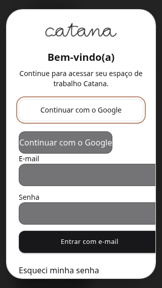
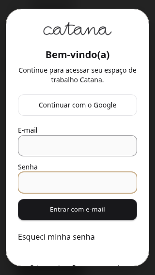

# Production Google OAuth regression audit

Audit date: 8 October 2026 (America/Sao_Paulo). Repository baseline: `c60cda95b3c50523335450ae9bfcc7b8e7af56d9`. No production, Clerk, or Google configuration was changed during this audit.

## 1. Executive Summary

Two separate failures were identified. Google rejects the Clerk callback because the corresponding OAuth client's authorized redirect list is empty, according to the operator's supplied configuration. The login widget also exposes a second Google entry and clips fields because SDK styles override Tailwind utility classes. This patch fixes the scoped appearance and strengthens browser coverage. Real Google login remains unverified until the external configuration is corrected and tested.

## 2. Last Known Good

The operator reports login working before the consolidation; no deployed SHA or successful OAuth trace establishes the exact last known good revision. `3cf4b7d` is the pre-consolidation main baseline, not a verified production success.

## 3. Regression Timeline

- PR12 merged 7 October at 13:43:05 BRT: authentication/session hardening.
- PR13 introduced consolidation at `976958b`; merged as `f6d6bcd` at 15:26:18 BRT. Google moved from the standalone GIS path to Clerk OAuth redirect.
- `c60cda9` at 15:38:26 BRT adjusted legacy bootstrap guards; it does not generate Google's callback request.
- On this audit, both fetched `main` and `production` point to `c60cda9`. This does not prove the VPS serves that revision.

## 4. Root Cause

OAuth: the old browser ID-token integration's authorized JavaScript origins do not authorize the new server callback. The operator supplied Google's `redirect_uri_mismatch`, the actual callback URI, and the matching client's empty authorized redirect section. Adding JavaScript origins cannot satisfy this requirement.

Appearance: `hidden` and width utilities passed through Clerk appearance lose to unlayered SDK styles. Existing global Clerk input styles also force dark colors in light mode. The previous SDK fixture omitted the internal social entry and fixed card width, concealing these failures.

## 5. Google OAuth Investigation

| Boundary | Evidence |
| --- | --- |
| Google request callback | `https://clerk.usecatana.com.br/v1/oauth_callback`, supplied in Google's error details |
| Clerk Production Google client | Operator reports suffix `…e91ocpd2.apps.googleusercontent.com` |
| Google Cloud client | Matching suffix; JavaScript origins include Catana and Clerk; authorized redirect list supplied empty |
| Compiled production Clerk instance/key | Unverified: production HTTP access returned 403 from this environment, including escalated retry |

The canonical application button uses Clerk `authenticateWithRedirect`, `oauth_google`, application return `/auth/callback`, and completed destination `/studio`. Google's callback to Clerk and Clerk's return to Catana are distinct. Do not add the application callback as a substitute for the URI Google actually rejects. The pasted Google telemetry content-blocker error is not evidence of an OAuth failure. The generic OOB help text does not establish an OOB flow; this callback is HTTPS.

## 6. Login UI Regression

The strengthened SDK fixture reproduced two visible Google entries at 320px before the patch. It models observed unlayered styling and public Clerk classes; it is not a real hosted Clerk instance. The installed React SDK supports the appearance elements used here. Inspected Clerk JS 5.128.0 source corroborates fit-content root, fixed card sizing and social controls; the actual production SDK version was not observed.

## 7. Deployment Investigation

Production HTML, current headers, asset hashes and running backend revision could not be retrieved. Historical headers from 7 October show `same-origin-allow-popups`; they do not establish today's deployment. Repository Nginx serves the SPA callback through `try_files`. Compose binds `frontend/dist` separately from the backend build, so mismatched artifacts are possible but unproven. No service worker registration was found. Existing build metadata records commit, provider and artifact hashes.

An authorized operator should compare the public `/build-metadata.json`, downloaded HTML asset filenames, repository-generated metadata and running backend image revision. Inspect only provider selection and the publishable key's instance hostname; do not paste secrets or dump environment files. Use the repository's production build/preflight procedure rather than treating this ordinary local build as production validation.

## 8. Fix Applied or Required Configuration

Plan A: in the matching Google OAuth web client, add exactly `https://clerk.usecatana.com.br/v1/oauth_callback` to **Authorized redirect URIs**, save, allow propagation, then perform real sign-in and sign-up through Clerk Production. This is an external operator action, not an action performed by this patch. Google AI Studio/Gemini credentials are a separate service.

The code patch adds scoped, explicit CSS for Clerk card sizing, hiding internal social/header/footer controls and theme-aware input/button colors. It retains one canonical visible Google entry using the existing Clerk SDK.

Plan B: while configuration propagates, use existing Clerk email/password or recovery only for accounts for which it is already supported. Do not switch to legacy authority, create replacement identities or bypass backend session checks. If affected accounts are Google-only, no verified repository-only workaround exists.

## 9. Security Review

OAuth handlers, state/callback recovery, JWT verification, token storage, tenant isolation, provisioning, webhooks and API authorization are unchanged. No standalone GIS path is restored. COOP is unchanged. No credentials were added to code or documentation. Other Clerk account/organization widgets remain outside the appearance scope.

## 10. Test Results

- Frontend: 229 tests passed across 24 files.
- Isolated social browser suite: 20 passed; seven widths (320, 375, 390, 768, 1024, 1440, 1920), each light and dark. Checks cover one visible Google control, field/card bounds, keyboard focus, input colors, touch size, recovery and readiness.
- Backend authentication/provisioning selection: 57 discovered, 55 passed, two concurrency tests skipped under SQLite.
- TypeScript and Vite build passed; existing bundle-size warning remains.
- Focused ESLint passed for the changed TypeScript files.
- Build configuration and COOP Node suites: 10 passed. Contract parity and repository COOP review passed.
- Local Docker Nginx syntax and TLS checks passed for `/`, `/sign-in`, `/api/profile/` and `/admin/`, each with exactly one `same-origin-allow-popups` header.
- Real Google OAuth and deployed frontend/backend correspondence remain untested. Browser fixtures do not establish production OAuth success.

## 11. Before/After

These screenshots are local fixture evidence, not production captures:

## 12. Remaining External Requirements

After the redirect registration propagates, verify the actual client/Clerk Production pairing and deployed build. Test existing-user login, new-user signup, cancellation and retry, reload, logout, required-login behavior, `/api/auth/me/` readiness and correct memberships with a real account. Verify production callback headers and no legacy password endpoint or premature ready state. Record sanitized outcomes; never share authorization headers, codes, cookies, state or tokens.

## 13. Files Changed

`ClerkAuthExperience.tsx` imports scoped `clerk-auth.css`. The SDK fixture models the styling boundary and embedded social entry. `social-auth.spec.ts` expands the viewport/theme checks and captures screenshots. This report and two fixture screenshots preserve evidence. Dependencies, lockfiles, deployment workflows and backend remain unchanged.

## 14. Rollback Plan

Revert the appearance/test patch if it regresses the login UI, preserving the prior authentication hardening. External redirect registration is a separate configuration change; an authorized operator can remove only the newly added URI if necessary. Do not roll back session/tenant isolation to mask an OAuth configuration error. No merge or deployment is authorized by this audit.

## 15. Production Readiness

BLOCKED BY EXTERNAL OAUTH CONFIGURATION

The appearance patch is reviewable; production authentication acceptance requires the external correction and a real OAuth round trip.
